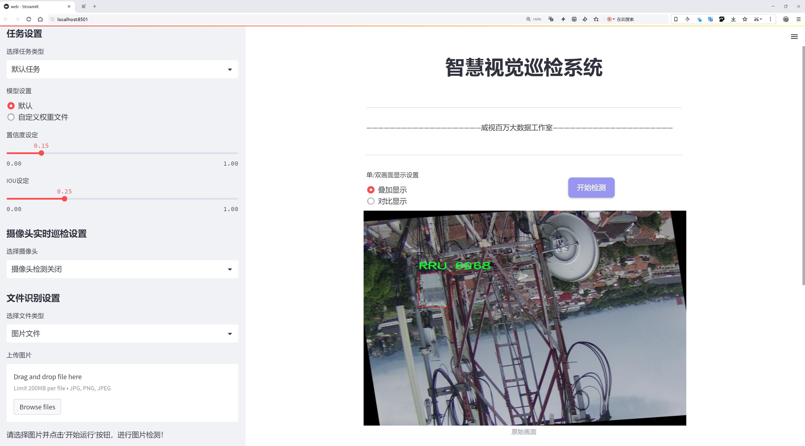

# 基站设备检测系统源码分享
 # [一条龙教学YOLOV8标注好的数据集一键训练_70+全套改进创新点发刊_Web前端展示]

### 1.研究背景与意义

项目参考[AAAI Association for the Advancement of Artificial Intelligence](https://gitee.com/qunmasj/projects)

项目来源[AACV Association for the Advancement of Computer Vision](https://kdocs.cn/l/cszuIiCKVNis)

研究背景与意义

随着通信技术的迅猛发展，基站设备的部署与维护成为了现代通信网络中不可或缺的一部分。基站作为无线通信的核心组成部分，其性能和稳定性直接影响到网络的覆盖范围和服务质量。近年来，随着5G及未来6G技术的逐步推广，基站设备的种类和数量急剧增加，如何高效、准确地检测和维护这些设备，成为了亟待解决的技术难题。在此背景下，基于改进YOLOv8的基站设备检测系统应运而生，旨在通过深度学习技术提高基站设备的检测效率和准确性。

YOLO（You Only Look Once）系列模型以其快速和高效的特性在目标检测领域取得了显著的成功。YOLOv8作为该系列的最新版本，结合了更先进的网络结构和算法优化，具备了更强的实时检测能力和更高的检测精度。然而，针对特定应用场景，如基站设备的检测，YOLOv8的性能仍有提升空间。通过对YOLOv8进行改进，结合基站设备的特点，可以更好地适应复杂的环境和多样化的设备类型。

本研究所使用的数据集“BSNL”包含2900张图像，涵盖了16个类别的基站设备。这些类别包括天线、鸟、螺栓、缆线、碟形天线、梯子、灯具、微波设备、杆、射频设备、远程无线单元（RRU）等。多样化的类别不仅反映了基站设备的复杂性，也为模型的训练提供了丰富的样本。通过对这些数据的深入分析和处理，可以有效提高模型对不同设备的识别能力，从而实现更为精准的检测。

在基站设备的检测过程中，环境因素如光照变化、天气影响以及设备的遮挡等都会对检测效果产生显著影响。因此，改进YOLOv8模型时，需考虑到这些因素的影响，采用数据增强、特征提取等技术，以提高模型的鲁棒性和适应性。此外，基于深度学习的检测系统还可以通过不断的学习和优化，逐步提升其检测精度和效率，为基站设备的智能化管理提供支持。

本研究的意义不仅在于提升基站设备的检测技术，更在于推动通信行业的智能化发展。通过实现高效的基站设备检测，可以大幅度降低人工巡检的成本，提高设备维护的及时性和准确性，从而提升整个通信网络的服务质量和用户体验。此外，基于改进YOLOv8的检测系统还可以为其他领域的目标检测提供借鉴，推动深度学习技术在更多应用场景中的落地与发展。

综上所述，基于改进YOLOv8的基站设备检测系统的研究，不仅具有重要的理论价值，也具备广泛的实际应用前景。通过对基站设备的高效检测与管理，能够为通信行业的可持续发展提供强有力的技术支持，推动行业的智能化转型与升级。

### 2.图片演示




##### 注意：由于此博客编辑较早，上面“2.图片演示”和“3.视频演示”展示的系统图片或者视频可能为老版本，新版本在老版本的基础上升级如下：（实际效果以升级的新版本为准）

  （1）适配了YOLOV8的“目标检测”模型和“实例分割”模型，通过加载相应的权重（.pt）文件即可自适应加载模型。

  （2）支持“图片识别”、“视频识别”、“摄像头实时识别”三种识别模式。

  （3）支持“图片识别”、“视频识别”、“摄像头实时识别”三种识别结果保存导出，解决手动导出（容易卡顿出现爆内存）存在的问题，识别完自动保存结果并导出到tempDir中。

  （4）支持Web前端系统中的标题、背景图等自定义修改，后面提供修改教程。

  另外本项目提供训练的数据集和训练教程,暂不提供权重文件（best.pt）,需要您按照教程进行训练后实现图片演示和Web前端界面演示的效果。

### 3.视频演示

[3.1 视频演示](https://www.bilibili.com/video/BV15p12YCEHB/)

### 4.数据集信息展示

##### 4.1 本项目数据集详细数据（类别数＆类别名）

nc: 16
names: ['Antenna', 'Bird', 'Bolt', 'Bolts', 'Cable', 'Cables', 'Dish', 'Ladder', 'Lamp', 'MW', 'Pole', 'RF', 'RRU', 'bolts', 'lamp', 'rusted bolt']


##### 4.2 本项目数据集信息介绍

数据集信息展示

在本研究中，我们使用了名为“BSNL”的数据集，旨在改进YOLOv8模型在基站设备检测系统中的表现。该数据集的设计和构建充分考虑了基站设备的多样性和复杂性，涵盖了16个不同的类别，这些类别不仅反映了基站设备的基本构成要素，还包括了与其功能和维护相关的多种组件。具体而言，数据集中包含的类别有：天线（Antenna）、鸟（Bird）、螺栓（Bolt）、螺栓（Bolts）、电缆（Cable）、电缆（Cables）、碟形天线（Dish）、梯子（Ladder）、灯具（Lamp）、微波设备（MW）、电杆（Pole）、射频设备（RF）、远程无线单元（RRU）、螺栓（bolts）、灯具（lamp）以及生锈的螺栓（rusted bolt）。这些类别的选择不仅反映了基站设备的构成，也为模型的训练提供了丰富的场景和多样化的目标。

数据集的多样性体现在多个方面。首先，设备的种类繁多，涵盖了从基础的结构组件（如电杆和梯子）到功能性设备（如天线和微波设备），这使得模型能够学习到不同设备的特征和识别方式。其次，数据集中还包含了与设备维护相关的元素，如生锈的螺栓，这不仅提高了模型在实际应用中的鲁棒性，也为其在复杂环境下的检测能力提供了支持。此外，鸟类的存在则增加了数据集的复杂性，模型需要在检测基站设备的同时，能够有效区分这些非目标物体，从而提升其在真实场景中的应用效果。

为了确保数据集的有效性和准确性，BSNL数据集的构建过程中，采用了严格的数据采集和标注流程。每一类目标都经过精确的标注，确保在训练过程中，模型能够获取到清晰且准确的目标信息。这种高质量的标注不仅提高了模型的学习效率，也为后续的模型评估提供了可靠的基础。数据集中的图像样本来自不同的环境和条件，包括城市和乡村的基站，晴天和阴雨天的场景，进一步增强了模型的泛化能力。

在训练过程中，BSNL数据集将作为YOLOv8模型的主要训练数据源，通过不断迭代和优化，模型将学习到如何在各种复杂场景中快速而准确地识别和定位基站设备。这一过程不仅需要强大的计算能力，还需要对数据集的深刻理解，以便在模型训练的每一个阶段都能充分利用数据集中的信息。最终，我们期望通过对BSNL数据集的深入分析和应用，能够显著提升YOLOv8在基站设备检测中的性能，使其在实际应用中更具实用性和可靠性。

综上所述，BSNL数据集的构建和应用为改进YOLOv8模型提供了坚实的基础，涵盖了丰富的类别和多样的场景，确保了模型在基站设备检测任务中的高效性和准确性。通过这一数据集的训练，我们相信能够推动基站设备检测技术的发展，为未来的通信基础设施建设提供更为智能化的解决方案。


### 5.全套项目环境部署视频教程（零基础手把手教学）

[5.1 环境部署教程链接（零基础手把手教学）](https://www.ixigua.com/7404473917358506534?logTag=c807d0cbc21c0ef59de5)


[5.2 安装Python虚拟环境创建和依赖库安装视频教程链接（零基础手把手教学）](https://www.ixigua.com/7404474678003106304?logTag=1f1041108cd1f708b01a)

### 6.手把手YOLOV8训练视频教程（零基础小白有手就能学会）

[6.1 手把手YOLOV8训练视频教程（零基础小白有手就能学会）](https://www.ixigua.com/7404477157818401292?logTag=d31a2dfd1983c9668658)


按照上面的训练视频教程链接加载项目提供的数据集，运行train.py即可开始训练



     Epoch   gpu_mem       box       obj       cls    labels  img_size
     1/200     20.8G   0.01576   0.01955  0.007536        22      1280: 100%|██████████| 849/849 [14:42<00:00,  1.04s/it]
               Class     Images     Labels          P          R     mAP@.5 mAP@.5:.95: 100%|██████████| 213/213 [01:14<00:00,  2.87it/s]
                 all       3395      17314      0.994      0.957      0.0957      0.0843

     Epoch   gpu_mem       box       obj       cls    labels  img_size
     2/200     20.8G   0.01578   0.01923  0.007006        22      1280: 100%|██████████| 849/849 [14:44<00:00,  1.04s/it]
               Class     Images     Labels          P          R     mAP@.5 mAP@.5:.95: 100%|██████████| 213/213 [01:12<00:00,  2.95it/s]
                 all       3395      17314      0.996      0.956      0.0957      0.0845

     Epoch   gpu_mem       box       obj       cls    labels  img_size
     3/200     20.8G   0.01561    0.0191  0.006895        27      1280: 100%|██████████| 849/849 [10:56<00:00,  1.29it/s]
               Class     Images     Labels          P          R     mAP@.5 mAP@.5:.95: 100%|███████   | 187/213 [00:52<00:00,  4.04it/s]
                 all       3395      17314      0.996      0.957      0.0957      0.0845


### 7.70+种全套YOLOV8创新点代码加载调参视频教程（一键加载写好的改进模型的配置文件）

[7.1 70+种全套YOLOV8创新点代码加载调参视频教程（一键加载写好的改进模型的配置文件）](https://www.ixigua.com/7404478314661806627?logTag=29066f8288e3f4eea3a4)

### 8.70+种全套YOLOV8创新点原理讲解（非科班也可以轻松写刊发刊，V10版本正在科研待更新）

#### 由于篇幅限制，每个创新点的具体原理讲解就不一一展开，具体见下列网址中的创新点对应子项目的技术原理博客网址【Blog】：


[8.1 70+种全套YOLOV8创新点原理讲解链接](https://gitee.com/qunmasj/good)

#### 部分改进原理讲解(完整的改进原理见上图和技术博客链接)
### CBAM空间注意力机制
近年来，随着深度学习研究方向的火热，注意力机制也被广泛地应用在图像识别、语音识别和自然语言处理等领域，注意力机制在深度学习任务中发挥着举足轻重的作用。注意力机制借鉴于人类的视觉系统，例如，人眼在看到一幅画面时，会倾向于关注画面中的重要信息，而忽略其他可见的信息。深度学习中的注意力机制和人类视觉的注意力机制相似，通过扫描全局数据，从大量数据中选择出需要重点关注的、对当前任务更为重要的信息，然后对这部分信息分配更多的注意力资源，从这些信息中获取更多所需要的细节信息，而抑制其他无用的信息。而在深度学习中，则具体表现为给感兴趣的区域更高的权重，经过网络的学习和调整，得到最优的权重分配，形成网络模型的注意力，使网络拥有更强的学习能力，加快网络的收敛速度。
注意力机制通常可分为软注意力机制和硬注意力机制[4-5]。软注意力机制在选择信息时，不是从输入的信息中只选择1个，而会用到所有输入信息，只是各个信息对应的权重分配不同，然后输入网络模型进行计算;硬注意力机制则是从输入的信息中随机选取一个或者选择概率最高的信息，但是这一步骤通常是不可微的，导致硬注意力机制更难训练。因此，软注意力机制应用更为广泛，按照原理可将软注意力机制划分为:通道注意力机制（channel attention)、空间注意力机制(spatial attention）和混合域注意力机制(mixed attention)。
通道注意力机制的本质建立各个特征通道之间的重要程度，对感兴趣的通道进行重点关注，弱化不感兴趣的通道的作用;空间注意力的本质则是建模了整个空间信息的重要程度，然后对空间内感兴趣的区域进行重点关注，弱化其余非感兴趣区域的作用;混合注意力同时运用了通道注意力和空间注意力，两部分先后进行或并行，形成对通道特征和空间特征同时关注的注意力模型。

卷积层注意力模块(Convolutional Block Attention Module，CBAM）是比较常用的混合注意力模块，其先后集中了通道注意力模块和空间注意力模块，网络中加入该模块能有效提高网络性能，减少网络模型的计算量，模块结构如图所示。输入特征图首先经过分支的通道注意力模块，然后和主干的原特征图融合，得到具有通道注意力的特征图，接着经过分支的空间注意力模块，在和主干的特征图融合后，得到同时具有通道特征注意力和空间特征注意力的特征图。CBAM模块不改变输入特征图的大小，因此该模块是一个“即插即用”的模块，可以插入网络的任何位置。

通道注意力模块的结构示意图如图所示，通道注意力模块分支并行地对输入的特征图进行最大池化操作和平均池化操作，然后利用多层感知机对结果进行变换，得到应用于两个通道的变换结果，最后经过sigmoid激活函数将变换结果融合，得到具有通道注意力的通道特征图。

空间注意力模块示意图如图所示，将通道注意力模块输出的特征图作为该模块的输入特征图，首先对输入特征图进行基于通道的最大池化操作和平均池化操作，将两部分得到的结果拼接起来，然后通过卷积得到降为Ⅰ通道的特征图，最后通过sigmoid激活函数生成具有空间注意力的特征图。


### 9.系统功能展示（检测对象为举例，实际内容以本项目数据集为准）

图9.1.系统支持检测结果表格显示

  图9.2.系统支持置信度和IOU阈值手动调节

  图9.3.系统支持自定义加载权重文件best.pt(需要你通过步骤5中训练获得)

  图9.4.系统支持摄像头实时识别

  图9.5.系统支持图片识别

  图9.6.系统支持视频识别

  图9.7.系统支持识别结果文件自动保存

  图9.8.系统支持Excel导出检测结果数据


### 10.原始YOLOV8算法原理

原始YOLOv8算法原理

YOLOv8模型是由Ultralytics团队在YOLOv5的基础上发展而来的新一代目标检测算法，于2023年1月正式发布。该模型在过去两年半的研究和实践中，吸收了众多经过验证的改进，旨在提高目标检测的精度和速度。YOLOv8不仅延续了YOLO系列模型的优良传统，还在结构设计和算法实现上进行了重要的创新。

YOLOv8的网络结构可以分为四个主要部分：输入层、Backbone骨干网络、Neck特征融合网络和Head检测模块。输入层负责对输入图像进行预处理，包括调整图像比例、进行Mosaic数据增强以及计算瞄点。这一阶段的设计旨在为后续的特征提取和检测提供高质量的输入数据。然而，YOLOv8在训练的最后10个epoch中停止使用Mosaic数据增强，以避免对数据真实分布的破坏，从而确保模型学习到的特征更加可靠。

在Backbone部分，YOLOv8主要采用了C2f模块替代了之前的C3模块。C2f模块的设计灵感来源于YOLOv7中的ELAN结构，增加了更多的跳层连接，从而增强了梯度流的信息传递。这种结构不仅提高了特征提取的丰富性，还保证了模型的轻量化，使得YOLOv8在计算资源有限的情况下依然能够保持高效的性能。此外，YOLOv8保留了SPPF模块，利用不同内核尺寸的池化对特征图进行合并，进一步提升了特征的表达能力。

在Neck部分，YOLOv8继续采用“双塔结构”，结合特征金字塔和路径聚合网络。这种设计促进了语义特征和定位特征的有效转移，使得网络能够更好地融合来自不同层次的特征信息。这一特征融合的能力对于检测不同尺度的目标至关重要，YOLOv8在这一方面表现尤为突出。

Head模块是YOLOv8的核心部分，采用了解耦头的结构，将回归分支和分类分支分开处理。这种设计的优势在于，分类任务更关注特征图中与已有类别的相似性，而定位任务则更注重边界框与真实框之间的关系。通过这种分离，YOLOv8在收敛速度和预测精度上都有了显著提升。此外，YOLOv8引入了无锚框结构，直接预测目标的中心位置，并通过任务对齐学习（Task Alignment Learning, TAL）来区分正负样本。这一创新使得模型在处理复杂场景时，能够更准确地进行目标检测。

在损失函数的设计上，YOLOv8引入了分类分数和IOU的高次幂乘积作为衡量任务对齐程度的指标。这一设计理念认为，只有同时具备良好的定位和分类性能，才能在实际应用中取得理想的效果。因此，YOLOv8在分类和定位损失函数中都引入了这一指标，以提高模型的整体性能。

在检测结果方面，YOLOv8在COCO数据集上的表现也非常出色。通过对比不同尺寸的模型，YOLOv8在参数数量没有显著增加的情况下，取得了更高的精度。同时，在推理速度上，YOLOv8也表现出了优越性，能够在保证检测精度的前提下，实现更快的推理速度。这些特性使得YOLOv8在实时性和准确性兼顾的任务中，尤其适合应用于如机器人垃圾分拣系统等需要快速反应的场景。

总的来说，YOLOv8作为YOLO系列的最新版本，凭借其高效的网络结构、创新的算法设计以及优越的性能，成为了目标检测领域的一个重要里程碑。它不仅在理论上推动了目标检测算法的发展，也在实际应用中展现了广泛的适用性和良好的效果。随着对YOLOv8的深入研究和应用，未来在目标检测的各个领域，尤其是对实时性要求较高的场景中，YOLOv8无疑将发挥越来越重要的作用。


### 11.项目核心源码讲解（再也不用担心看不懂代码逻辑）

#### 11.1 70+种YOLOv8算法改进源码大全和调试加载训练教程（非必要）\ultralytics\data\utils.py

以下是对代码中最核心部分的提取和详细中文注释：

```python
import os
import hashlib
import numpy as np
from PIL import Image, ImageOps
from ultralytics.utils import check_class_names, yaml_load, check_file

IMG_FORMATS = 'bmp', 'jpeg', 'jpg', 'png', 'tif', 'tiff'  # 支持的图像格式

def img2label_paths(img_paths):
    """根据图像路径定义标签路径"""
    sa, sb = f'{os.sep}images{os.sep}', f'{os.sep}labels{os.sep}'  # 图像和标签的子字符串
    return [sb.join(x.rsplit(sa, 1)).rsplit('.', 1)[0] + '.txt' for x in img_paths]

def get_hash(paths):
    """返回路径列表（文件或目录）的单个哈希值"""
    size = sum(os.path.getsize(p) for p in paths if os.path.exists(p))  # 计算文件大小总和
    h = hashlib.sha256(str(size).encode())  # 基于大小生成哈希
    h.update(''.join(paths).encode())  # 更新哈希值以包含路径
    return h.hexdigest()  # 返回哈希值

def verify_image(im_file):
    """验证单个图像的有效性"""
    nf, nc, msg = 0, 0, ''  # found, corrupt
    try:
        im = Image.open(im_file)  # 打开图像
        im.verify()  # 验证图像
        shape = im.size  # 获取图像尺寸
        assert (shape[0] > 9) & (shape[1] > 9), f'image size {shape} <10 pixels'  # 检查图像尺寸
        assert im.format.lower() in IMG_FORMATS, f'invalid image format {im.format}'  # 检查图像格式
        nf = 1  # 图像有效
    except Exception as e:
        nc = 1  # 图像损坏
        msg = f'WARNING ⚠️ {im_file}: ignoring corrupt image: {e}'  # 错误信息
    return im_file, nf, nc, msg  # 返回图像文件名、有效图像数量、损坏图像数量和消息

def check_det_dataset(dataset):
    """
    检查检测数据集的有效性，下载并解析数据集的YAML文件。
    
    Args:
        dataset (str): 数据集路径或描述符（如YAML文件）。
    
    Returns:
        (dict): 解析后的数据集信息和路径。
    """
    data = check_file(dataset)  # 检查文件是否存在

    # 读取YAML文件
    if isinstance(data, (str, Path)):
        data = yaml_load(data, append_filename=True)  # 加载YAML文件为字典

    # 检查关键字段
    for k in 'train', 'val':
        if k not in data:
            raise SyntaxError(f"{dataset} '{k}:' key missing ❌.")  # 检查训练和验证字段
    if 'names' not in data and 'nc' not in data:
        raise SyntaxError(f"{dataset} key missing ❌.")  # 检查类名和类数

    # 解析路径
    path = Path(data.get('path'))  # 数据集根路径
    data['path'] = path  # 更新数据字典中的路径
    return data  # 返回数据集信息字典

class HUBDatasetStats:
    """
    生成HUB数据集JSON和`-hub`数据集目录的类。
    
    Args:
        path (str): 数据集路径。
        task (str): 数据集任务类型（如'detect'）。
    """
    def __init__(self, path='coco128.yaml', task='detect'):
        """初始化类"""
        self.task = task  # 任务类型
        data = check_det_dataset(path)  # 检查数据集并获取数据
        self.stats = {'nc': len(data['names']), 'names': list(data['names'].values())}  # 统计信息字典

    def get_json(self, save=False):
        """返回数据集的JSON格式"""
        # 统计信息的处理逻辑
        if save:
            # 保存统计信息为JSON文件
            pass
        return self.stats  # 返回统计信息

def compress_one_image(f, f_new=None, max_dim=1920, quality=50):
    """
    压缩单个图像文件，保持其宽高比和质量。
    
    Args:
        f (str): 输入图像文件路径。
        f_new (str, optional): 输出图像文件路径。
        max_dim (int, optional): 输出图像的最大尺寸。
        quality (int, optional): 图像压缩质量。
    """
    try:
        im = Image.open(f)  # 打开图像
        r = max_dim / max(im.height, im.width)  # 计算缩放比例
        if r < 1.0:  # 如果图像过大
            im = im.resize((int(im.width * r), int(im.height * r)))  # 调整图像大小
        im.save(f_new or f, 'JPEG', quality=quality, optimize=True)  # 保存图像
    except Exception as e:
        # 错误处理
        pass
```

### 核心部分分析
1. **图像与标签路径处理**：`img2label_paths` 函数用于根据图像路径生成对应的标签路径。
2. **哈希计算**：`get_hash` 函数用于计算文件或目录的哈希值，以便于数据集的完整性检查。
3. **图像验证**：`verify_image` 函数用于验证图像的有效性，包括格式和尺寸的检查。
4. **数据集检查**：`check_det_dataset` 函数用于检查数据集的结构和必要字段，确保数据集的完整性。
5. **HUB数据集统计**：`HUBDatasetStats` 类用于处理HUB数据集的统计信息，并生成相应的JSON格式。
6. **图像压缩**：`compress_one_image` 函数用于压缩图像，保持其质量和宽高比。

这些核心部分构成了数据集处理和验证的基础，确保数据集的有效性和可用性。

这个文件是YOLOv8算法中的一个工具模块，主要用于处理数据集相关的功能。代码中包含了一系列函数和类，用于验证图像和标签的有效性、处理数据集的路径、下载和解压数据集、生成数据集的统计信息等。

首先，文件导入了一些必要的库，包括处理文件和路径的库、图像处理库（如PIL和OpenCV）、以及用于多线程处理的库。接着，定义了一些常量，比如支持的图像和视频格式，以及全局的内存固定设置。

在函数方面，`img2label_paths`函数根据图像路径生成对应的标签路径，`get_hash`函数用于计算给定路径列表的哈希值，以便于验证文件的完整性。`exif_size`函数用于获取经过EXIF校正的图像尺寸，确保在处理JPEG图像时考虑到旋转信息。

`verify_image`和`verify_image_label`函数用于验证单个图像和图像-标签对的有效性。它们会检查图像是否损坏、格式是否正确、标签文件是否存在等，并返回相应的结果。

接下来，`polygon2mask`和`polygons2masks`函数用于将多边形转换为二进制掩码，适用于分割任务。`find_dataset_yaml`函数用于查找与数据集相关的YAML文件，确保数据集的格式正确。

`check_det_dataset`和`check_cls_dataset`函数用于检查检测和分类数据集的有效性，包括下载数据集、解析YAML文件、验证数据集的结构等。这些函数会确保数据集的训练、验证和测试集路径正确，并且类名和数量匹配。

`HUBDatasetStats`类用于生成HUB数据集的JSON文件和相关目录。它可以处理不同类型的数据集（检测、分割、姿态、分类），并提供方法来获取数据集的统计信息和压缩图像。

最后，`compress_one_image`函数用于压缩单个图像，以减小文件大小，同时保持其长宽比和质量。`autosplit`函数则用于自动将数据集拆分为训练、验证和测试集，并保存相应的文本文件。

总体而言，这个模块提供了丰富的功能，支持YOLOv8算法在处理数据集时的各种需求，确保数据的有效性和完整性，为后续的模型训练和评估打下基础。

#### 11.2 code\ultralytics\nn\__init__.py

```python
# 导入必要的任务模块
from .tasks import (
    BaseModel,          # 基础模型类
    ClassificationModel, # 分类模型类
    DetectionModel,      # 检测模型类
    SegmentationModel,   # 分割模型类
    attempt_load_one_weight, # 尝试加载单个权重
    attempt_load_weights,     # 尝试加载多个权重
    guess_model_scale,        # 猜测模型的尺度
    guess_model_task,         # 猜测模型的任务类型
    parse_model,              # 解析模型
    torch_safe_load,          # 安全加载 PyTorch 模型
    yaml_model_load,          # 从 YAML 文件加载模型
)

# 定义模块的公开接口
__all__ = (
    "attempt_load_one_weight", # 公开加载单个权重的函数
    "attempt_load_weights",     # 公开加载多个权重的函数
    "parse_model",              # 公开解析模型的函数
    "yaml_model_load",          # 公开从 YAML 文件加载模型的函数
    "guess_model_task",         # 公开猜测模型任务的函数
    "guess_model_scale",        # 公开猜测模型尺度的函数
    "torch_safe_load",          # 公开安全加载 PyTorch 模型的函数
    "DetectionModel",           # 公开检测模型类
    "SegmentationModel",        # 公开分割模型类
    "ClassificationModel",      # 公开分类模型类
    "BaseModel",                # 公开基础模型类
)
```

### 代码注释说明：
1. **导入模块**：从当前包的 `tasks` 模块中导入了多个模型类和函数，这些类和函数是构建和使用 YOLO 模型所需的核心组件。
   
2. **模型类**：
   - `BaseModel`：基础模型类，可能是其他模型类的基类。
   - `ClassificationModel`：用于图像分类的模型类。
   - `DetectionModel`：用于目标检测的模型类。
   - `SegmentationModel`：用于图像分割的模型类。

3. **功能函数**：
   - `attempt_load_one_weight`：尝试加载单个模型权重。
   - `attempt_load_weights`：尝试加载多个模型权重。
   - `guess_model_scale`：根据输入信息猜测模型的尺度。
   - `guess_model_task`：根据输入信息猜测模型的任务类型。
   - `parse_model`：解析模型结构。
   - `torch_safe_load`：安全地加载 PyTorch 模型，防止潜在的错误。
   - `yaml_model_load`：从 YAML 文件中加载模型配置。

4. **公开接口**：`__all__` 列表定义了模块的公开接口，指定了可以被外部导入的类和函数。这有助于控制模块的可见性，避免不必要的实现细节暴露给用户。

这个程序文件是Ultralytics YOLO（一个流行的目标检测模型）库的一部分，遵循AGPL-3.0许可证。文件的主要功能是导入和组织与模型相关的任务和功能，以便在其他模块中使用。

首先，文件通过相对导入的方式引入了多个类和函数，这些类和函数定义在同一包的`tasks`模块中。具体来说，导入的内容包括：

- `BaseModel`：这是一个基础模型类，可能包含所有模型共享的基本功能和属性。
- `ClassificationModel`：用于分类任务的模型类，专注于图像分类。
- `DetectionModel`：用于目标检测任务的模型类，能够识别图像中的物体及其位置。
- `SegmentationModel`：用于图像分割任务的模型类，能够对图像中的每个像素进行分类。
- `attempt_load_one_weight`：一个函数，可能用于加载单个模型权重。
- `attempt_load_weights`：一个函数，用于加载模型的权重文件。
- `guess_model_scale`：一个函数，可能用于推测模型的规模。
- `guess_model_task`：一个函数，用于推测模型的任务类型（如分类、检测或分割）。
- `parse_model`：一个函数，可能用于解析模型的结构或配置。
- `torch_safe_load`：一个函数，可能用于安全地加载PyTorch模型。
- `yaml_model_load`：一个函数，可能用于从YAML文件中加载模型配置。

在文件的最后，使用`__all__`定义了一个公共接口，列出了可以被外部模块导入的名称。这种做法有助于控制模块的可见性，确保用户只访问到必要的功能和类，从而避免直接访问内部实现细节。

总体而言，这个文件的作用是为Ultralytics YOLO库提供一个清晰的接口，使得其他模块能够方便地使用与模型相关的功能和类。

#### 11.3 ui.py

```python
import sys
import subprocess

def run_script(script_path):
    """
    使用当前 Python 环境运行指定的脚本。

    Args:
        script_path (str): 要运行的脚本路径

    Returns:
        None
    """
    # 获取当前 Python 解释器的路径
    python_path = sys.executable

    # 构建运行命令
    command = f'"{python_path}" -m streamlit run "{script_path}"'

    # 执行命令
    result = subprocess.run(command, shell=True)
    if result.returncode != 0:
        print("脚本运行出错。")


# 实例化并运行应用
if __name__ == "__main__":
    # 指定您的脚本路径
    script_path = "web.py"  # 这里可以直接指定脚本路径

    # 运行脚本
    run_script(script_path)
```

### 代码注释说明：

1. **导入模块**：
   - `import sys`：导入 sys 模块，用于访问与 Python 解释器紧密相关的变量和函数。
   - `import subprocess`：导入 subprocess 模块，用于创建新进程、连接到它们的输入/输出/错误管道，并获取它们的返回码。

2. **定义函数 `run_script`**：
   - `def run_script(script_path)`：定义一个函数，接受一个参数 `script_path`，表示要运行的脚本路径。
   - `python_path = sys.executable`：获取当前 Python 解释器的路径，确保使用的是正确的 Python 环境。
   - `command = f'"{python_path}" -m streamlit run "{script_path}"'`：构建要执行的命令，使用 `streamlit` 模块运行指定的脚本。
   - `result = subprocess.run(command, shell=True)`：使用 `subprocess.run` 执行构建的命令，`shell=True` 表示在 shell 中执行命令。
   - `if result.returncode != 0`：检查命令的返回码，如果不为 0，表示执行出错，打印错误信息。

3. **主程序入口**：
   - `if __name__ == "__main__":`：确保该代码块仅在直接运行脚本时执行，而不是在被导入时执行。
   - `script_path = "web.py"`：指定要运行的脚本路径，这里可以根据需要修改。
   - `run_script(script_path)`：调用 `run_script` 函数，传入脚本路径以执行该脚本。

这个程序文件的主要功能是使用当前的 Python 环境来运行一个指定的脚本，具体来说是运行一个名为 `web.py` 的脚本。程序首先导入了必要的模块，包括 `sys`、`os` 和 `subprocess`，以及一个自定义的 `abs_path` 函数，用于获取文件的绝对路径。

在 `run_script` 函数中，首先获取当前 Python 解释器的路径，这通过 `sys.executable` 实现。接着，构建一个命令字符串，该命令用于调用 `streamlit` 来运行指定的脚本。这里使用了 `-m` 参数，表示以模块的方式运行 `streamlit`，并将 `script_path` 作为参数传递给它。

随后，使用 `subprocess.run` 方法执行构建好的命令。这个方法会在一个新的 shell 中运行命令，并等待其完成。如果脚本运行过程中出现错误，返回的 `returncode` 将不为零，此时程序会打印出“脚本运行出错”的提示信息。

在文件的最后部分，程序通过 `if __name__ == "__main__":` 判断当前模块是否是主程序。如果是，它会调用 `abs_path` 函数来获取 `web.py` 的绝对路径，并将其传递给 `run_script` 函数，从而启动脚本的运行。这样，整个程序的结构清晰，功能明确，主要用于简化和自动化脚本的执行过程。

#### 11.4 70+种YOLOv8算法改进源码大全和调试加载训练教程（非必要）\ultralytics\models\nas\model.py

以下是代码中最核心的部分，并附上详细的中文注释：

```python
from pathlib import Path
import torch
from ultralytics.engine.model import Model
from ultralytics.utils.torch_utils import model_info, smart_inference_mode
from .predict import NASPredictor
from .val import NASValidator

class NAS(Model):
    """
    YOLO NAS模型用于目标检测。

    该类提供了YOLO-NAS模型的接口，并扩展了Ultralytics引擎中的`Model`类。
    它旨在简化使用预训练或自定义训练的YOLO-NAS模型进行目标检测的任务。
    """

    def __init__(self, model='yolo_nas_s.pt') -> None:
        """初始化NAS模型，使用提供的或默认的'yolo_nas_s.pt'模型。"""
        # 确保提供的模型文件不是YAML配置文件
        assert Path(model).suffix not in ('.yaml', '.yml'), 'YOLO-NAS模型仅支持预训练模型。'
        # 调用父类的初始化方法
        super().__init__(model, task='detect')

    @smart_inference_mode()
    def _load(self, weights: str, task: str):
        """加载现有的NAS模型权重，或如果未提供，则创建一个新的NAS模型并使用预训练权重。"""
        import super_gradients
        suffix = Path(weights).suffix
        # 根据权重文件的后缀加载模型
        if suffix == '.pt':
            self.model = torch.load(weights)  # 从.pt文件加载模型
        elif suffix == '':
            self.model = super_gradients.training.models.get(weights, pretrained_weights='coco')  # 获取预训练模型
        
        # 标准化模型属性
        self.model.fuse = lambda verbose=True: self.model  # 融合模型
        self.model.stride = torch.tensor([32])  # 设置步幅
        self.model.names = dict(enumerate(self.model._class_names))  # 类别名称映射
        self.model.is_fused = lambda: False  # 用于信息获取
        self.model.yaml = {}  # 用于信息获取
        self.model.pt_path = weights  # 导出时的路径
        self.model.task = 'detect'  # 导出时的任务类型

    def info(self, detailed=False, verbose=True):
        """
        记录模型信息。

        参数:
            detailed (bool): 是否显示模型的详细信息。
            verbose (bool): 控制输出的详细程度。
        """
        return model_info(self.model, detailed=detailed, verbose=verbose, imgsz=640)

    @property
    def task_map(self):
        """返回一个字典，将任务映射到相应的预测器和验证器类。"""
        return {'detect': {'predictor': NASPredictor, 'validator': NASValidator}}
```

### 代码核心部分说明：
1. **类定义**：`NAS`类继承自`Model`类，主要用于目标检测任务。
2. **初始化方法**：在初始化时，检查模型文件的类型，并调用父类的初始化方法。
3. **加载模型**：`_load`方法根据权重文件的后缀加载模型，支持从`.pt`文件或通过`super_gradients`获取预训练模型。
4. **模型信息**：`info`方法用于记录和返回模型的相关信息。
5. **任务映射**：`task_map`属性返回一个字典，映射检测任务到相应的预测器和验证器类。

这个程序文件是一个关于YOLO-NAS模型的接口实现，主要用于目标检测任务。文件中首先导入了一些必要的库和模块，包括路径处理库`Path`、深度学习框架`torch`、以及Ultralytics引擎中的`Model`类和一些工具函数。

在文件的开头，有一个简要的使用示例，展示了如何从`ultralytics`模块导入`NAS`类，并创建一个YOLO-NAS模型实例，然后对一张图片进行预测。接下来，定义了`NAS`类，它继承自`Model`类，提供了YOLO-NAS模型的接口，旨在简化使用预训练或自定义训练的YOLO-NAS模型进行目标检测的过程。

`NAS`类的构造函数`__init__`接受一个参数`model`，默认为'yolo_nas_s.pt'，用于初始化模型。构造函数中有一个断言，确保传入的模型路径不以`.yaml`或`.yml`结尾，因为YOLO-NAS模型只支持预训练模型，而不支持YAML配置文件。

在`_load`方法中，模型的权重被加载。该方法首先检查权重文件的后缀，如果是`.pt`，则使用`torch.load`加载模型；如果没有后缀，则使用`super_gradients`库获取预训练模型。随后，模型的一些属性被标准化设置，包括模型的融合状态、步幅、类别名称等。

`info`方法用于记录模型的信息，可以选择是否显示详细信息和控制输出的详细程度。最后，`task_map`属性返回一个字典，映射任务到相应的预测器和验证器类，这里主要是针对目标检测任务。

整体来看，这个文件提供了一个清晰的接口，使得用户能够方便地使用YOLO-NAS模型进行目标检测，并且包含了必要的模型加载和信息查询功能。

#### 11.5 70+种YOLOv8算法改进源码大全和调试加载训练教程（非必要）\ultralytics\nn\backbone\fasternet.py

以下是经过简化和注释的核心代码部分：

```python
import torch
import torch.nn as nn
from typing import List
from torch import Tensor

class Partial_conv3(nn.Module):
    """部分卷积层，用于处理输入特征图的部分通道"""
    
    def __init__(self, dim, n_div, forward):
        super().__init__()
        self.dim_conv3 = dim // n_div  # 计算卷积的通道数
        self.dim_untouched = dim - self.dim_conv3  # 未处理的通道数
        self.partial_conv3 = nn.Conv2d(self.dim_conv3, self.dim_conv3, 3, 1, 1, bias=False)  # 定义卷积层

        # 根据前向传播方式选择相应的前向函数
        if forward == 'slicing':
            self.forward = self.forward_slicing
        elif forward == 'split_cat':
            self.forward = self.forward_split_cat
        else:
            raise NotImplementedError

    def forward_slicing(self, x: Tensor) -> Tensor:
        """仅用于推理阶段的前向传播"""
        x = x.clone()  # 保持原始输入不变，以便后续的残差连接
        x[:, :self.dim_conv3, :, :] = self.partial_conv3(x[:, :self.dim_conv3, :, :])  # 处理部分通道
        return x

    def forward_split_cat(self, x: Tensor) -> Tensor:
        """用于训练和推理阶段的前向传播"""
        x1, x2 = torch.split(x, [self.dim_conv3, self.dim_untouched], dim=1)  # 分割输入特征图
        x1 = self.partial_conv3(x1)  # 处理分割出的部分
        x = torch.cat((x1, x2), 1)  # 连接处理后的部分和未处理的部分
        return x


class MLPBlock(nn.Module):
    """多层感知机块，用于特征处理"""
    
    def __init__(self, dim, n_div, mlp_ratio, drop_path, layer_scale_init_value, act_layer, norm_layer, pconv_fw_type):
        super().__init__()
        self.dim = dim
        self.mlp_ratio = mlp_ratio
        self.drop_path = nn.Identity() if drop_path <= 0 else nn.Dropout(drop_path)  # 随机丢弃层
        self.n_div = n_div

        mlp_hidden_dim = int(dim * mlp_ratio)  # 计算隐藏层维度

        # 定义多层感知机的层
        mlp_layer: List[nn.Module] = [
            nn.Conv2d(dim, mlp_hidden_dim, 1, bias=False),
            norm_layer(mlp_hidden_dim),
            act_layer(),
            nn.Conv2d(mlp_hidden_dim, dim, 1, bias=False)
        ]
        self.mlp = nn.Sequential(*mlp_layer)  # 将层组合成一个序列

        # 定义空间混合层
        self.spatial_mixing = Partial_conv3(dim, n_div, pconv_fw_type)

    def forward(self, x: Tensor) -> Tensor:
        """前向传播"""
        shortcut = x  # 保存输入以进行残差连接
        x = self.spatial_mixing(x)  # 进行空间混合
        x = shortcut + self.drop_path(self.mlp(x))  # 残差连接
        return x


class FasterNet(nn.Module):
    """FasterNet模型"""
    
    def __init__(self, in_chans=3, num_classes=1000, embed_dim=96, depths=(1, 2, 8, 2), mlp_ratio=2., n_div=4,
                 patch_size=4, patch_stride=4, drop_path_rate=0.1, norm_layer=nn.BatchNorm2d, act_layer=nn.ReLU):
        super().__init__()

        self.patch_embed = nn.Conv2d(in_chans, embed_dim, kernel_size=patch_size, stride=patch_stride, bias=False)  # 定义补丁嵌入层

        # 构建网络的各个阶段
        stages_list = []
        for i_stage in range(len(depths)):
            stage = MLPBlock(dim=int(embed_dim * 2 ** i_stage), n_div=n_div, mlp_ratio=mlp_ratio, drop_path=drop_path,
                             layer_scale_init_value=0, norm_layer=norm_layer, act_layer=act_layer, pconv_fw_type='split_cat')
            stages_list.append(stage)

        self.stages = nn.Sequential(*stages_list)  # 将所有阶段组合成一个序列

    def forward(self, x: Tensor) -> Tensor:
        """前向传播，输出各个阶段的特征"""
        x = self.patch_embed(x)  # 进行补丁嵌入
        outs = []
        for stage in self.stages:
            x = stage(x)  # 通过每个阶段
            outs.append(x)  # 收集输出
        return outs  # 返回所有阶段的输出


# 示例代码：创建FasterNet模型并进行前向传播
if __name__ == '__main__':
    model = FasterNet()  # 创建FasterNet模型
    inputs = torch.randn((1, 3, 640, 640))  # 创建随机输入
    outputs = model(inputs)  # 进行前向传播
    for output in outputs:
        print(output.size())  # 打印每个阶段的输出尺寸
```

### 代码说明：
1. **Partial_conv3**: 定义了一个部分卷积层，可以选择不同的前向传播方式（切片或拼接）。
2. **MLPBlock**: 定义了一个多层感知机块，包含空间混合和残差连接。
3. **FasterNet**: 主模型类，包含多个MLPBlock，进行特征提取和处理。
4. **前向传播**: 在`FasterNet`中，输入经过补丁嵌入和多个阶段的处理，最终输出各个阶段的特征。

这段代码的核心在于定义了一个深度学习模型的结构，能够处理输入数据并提取特征。

这个程序文件实现了一个名为FasterNet的深度学习模型，主要用于图像处理任务。代码中包含多个类和函数，构成了模型的结构和功能。

首先，文件导入了必要的库，包括PyTorch、yaml和一些用于构建神经网络的模块。接着，定义了几个重要的类。`Partial_conv3`类实现了部分卷积的功能，可以选择不同的前向传播方式（切片或拼接），用于处理输入特征图。`MLPBlock`类实现了多层感知机模块，包含卷积层、归一化层和激活函数，并结合了DropPath技术以增强模型的泛化能力。`BasicStage`类则由多个`MLPBlock`组成，形成了模型的基本构建块。

接下来，`PatchEmbed`和`PatchMerging`类用于图像的嵌入和合并操作，将输入图像划分为多个补丁并进行处理。`FasterNet`类是整个模型的核心，初始化时接收多个参数以配置模型的结构，包括输入通道数、类别数、嵌入维度、深度等。模型通过`patch_embed`将输入图像转化为补丁，并通过多个阶段的处理生成特征输出。

在模型的前向传播中，输入图像经过补丁嵌入后，依次通过各个阶段，最终输出特征图。模型的输出层使用了归一化层，以便于后续的处理。

此外，文件中还定义了一些函数用于加载模型权重和配置文件，例如`fasternet_t0`、`fasternet_t1`等，这些函数根据指定的配置文件创建相应的FasterNet模型，并可选择性地加载预训练权重。

最后，在主程序部分，示例代码展示了如何使用`fasternet_t0`函数创建模型，并打印出模型的通道信息和输出特征图的尺寸。这段代码可以帮助用户理解如何初始化和使用FasterNet模型。

#### 11.6 train.py

以下是经过简化和注释的核心代码部分，主要关注于YOLO检测模型的训练过程：

```python
import random
import numpy as np
import torch.nn as nn
from ultralytics.data import build_dataloader, build_yolo_dataset
from ultralytics.engine.trainer import BaseTrainer
from ultralytics.models import yolo
from ultralytics.nn.tasks import DetectionModel
from ultralytics.utils import LOGGER, RANK
from ultralytics.utils.torch_utils import de_parallel, torch_distributed_zero_first

class DetectionTrainer(BaseTrainer):
    """
    DetectionTrainer类用于基于YOLO模型进行目标检测的训练。
    """

    def build_dataset(self, img_path, mode="train", batch=None):
        """
        构建YOLO数据集。

        参数:
            img_path (str): 包含图像的文件夹路径。
            mode (str): 模式，'train'表示训练模式，'val'表示验证模式。
            batch (int, optional): 批次大小，仅用于'val'模式。
        """
        gs = max(int(de_parallel(self.model).stride.max() if self.model else 0), 32)  # 获取模型的最大步幅
        return build_yolo_dataset(self.args, img_path, batch, self.data, mode=mode, rect=mode == "val", stride=gs)

    def get_dataloader(self, dataset_path, batch_size=16, rank=0, mode="train"):
        """构建并返回数据加载器。"""
        assert mode in ["train", "val"]  # 确保模式有效
        with torch_distributed_zero_first(rank):  # 在分布式训练中，仅初始化一次数据集
            dataset = self.build_dataset(dataset_path, mode, batch_size)
        shuffle = mode == "train"  # 训练模式下打乱数据
        workers = self.args.workers if mode == "train" else self.args.workers * 2  # 设置工作线程数
        return build_dataloader(dataset, batch_size, workers, shuffle, rank)  # 返回数据加载器

    def preprocess_batch(self, batch):
        """对图像批次进行预处理，包括缩放和转换为浮点数。"""
        batch["img"] = batch["img"].to(self.device, non_blocking=True).float() / 255  # 将图像转换为浮点数并归一化
        if self.args.multi_scale:  # 如果启用多尺度训练
            imgs = batch["img"]
            sz = (
                random.randrange(self.args.imgsz * 0.5, self.args.imgsz * 1.5 + self.stride)
                // self.stride
                * self.stride
            )  # 随机选择图像大小
            sf = sz / max(imgs.shape[2:])  # 计算缩放因子
            if sf != 1:
                ns = [
                    math.ceil(x * sf / self.stride) * self.stride for x in imgs.shape[2:]
                ]  # 计算新的图像形状
                imgs = nn.functional.interpolate(imgs, size=ns, mode="bilinear", align_corners=False)  # 进行插值缩放
            batch["img"] = imgs
        return batch

    def get_model(self, cfg=None, weights=None, verbose=True):
        """返回YOLO检测模型。"""
        model = DetectionModel(cfg, nc=self.data["nc"], verbose=verbose and RANK == -1)  # 创建检测模型
        if weights:
            model.load(weights)  # 加载权重
        return model

    def plot_training_samples(self, batch, ni):
        """绘制训练样本及其标注。"""
        plot_images(
            images=batch["img"],
            batch_idx=batch["batch_idx"],
            cls=batch["cls"].squeeze(-1),
            bboxes=batch["bboxes"],
            paths=batch["im_file"],
            fname=self.save_dir / f"train_batch{ni}.jpg",
            on_plot=self.on_plot,
        )

    def plot_metrics(self):
        """从CSV文件中绘制指标。"""
        plot_results(file=self.csv, on_plot=self.on_plot)  # 保存结果图
```

### 代码说明
1. **DetectionTrainer类**：继承自`BaseTrainer`，用于实现YOLO模型的训练逻辑。
2. **build_dataset方法**：根据输入路径和模式构建YOLO数据集，支持训练和验证模式。
3. **get_dataloader方法**：构建数据加载器，支持分布式训练，设置数据打乱和工作线程数。
4. **preprocess_batch方法**：对输入的图像批次进行预处理，包括归一化和多尺度调整。
5. **get_model方法**：创建并返回YOLO检测模型，支持加载预训练权重。
6. **plot_training_samples方法**：绘制训练样本及其标注，便于可视化训练过程。
7. **plot_metrics方法**：从CSV文件中绘制训练指标，便于监控训练效果。

这个程序文件 `train.py` 是一个用于训练目标检测模型的代码，主要基于 YOLO（You Only Look Once）框架。它通过继承 `BaseTrainer` 类，定义了一个 `DetectionTrainer` 类，专门用于处理目标检测任务。

在文件开头，导入了一些必要的库和模块，包括数学运算、随机数生成、深度学习相关的库（如 PyTorch），以及一些来自 `ultralytics` 的模块，这些模块提供了数据加载、模型构建、训练和可视化等功能。

`DetectionTrainer` 类的构造函数和方法主要用于以下几个方面：

1. **构建数据集**：`build_dataset` 方法根据给定的图像路径和模式（训练或验证）构建 YOLO 数据集。该方法还考虑了图像的批处理大小和步幅。

2. **获取数据加载器**：`get_dataloader` 方法创建并返回一个数据加载器，支持分布式训练。它会根据模式决定是否打乱数据，并根据需要调整工作线程的数量。

3. **预处理批次数据**：`preprocess_batch` 方法对输入的图像批次进行预处理，包括将图像缩放到合适的大小并转换为浮点数格式。这个过程还支持多尺度训练。

4. **设置模型属性**：`set_model_attributes` 方法将数据集中的类别数量和类别名称附加到模型上，并配置模型的超参数。

5. **获取模型**：`get_model` 方法返回一个 YOLO 检测模型实例，并可以加载预训练权重。

6. **获取验证器**：`get_validator` 方法返回一个用于模型验证的 `DetectionValidator` 实例。

7. **损失项标签**：`label_loss_items` 方法用于返回带有标签的训练损失项字典，便于监控训练过程中的损失变化。

8. **训练进度字符串**：`progress_string` 方法返回一个格式化的字符串，显示训练进度，包括当前的 epoch、GPU 内存使用情况、损失值、实例数量和图像大小。

9. **绘制训练样本**：`plot_training_samples` 方法用于绘制训练样本及其标注，便于可视化训练数据的质量。

10. **绘制指标**：`plot_metrics` 方法从 CSV 文件中绘制训练指标，以便分析模型的性能。

11. **绘制训练标签**：`plot_training_labels` 方法创建一个带标签的训练图，显示模型在训练集上的标注情况。

整体而言，这个文件实现了 YOLO 模型的训练过程，涵盖了数据准备、模型构建、训练监控和结果可视化等多个方面，适合用于目标检测任务的开发和研究。

### 12.系统整体结构（节选）

### 整体功能和构架概括

该程序库是一个基于YOLOv8框架的目标检测和图像处理工具集，包含了多个模块和功能，旨在为用户提供高效的模型训练、推理和数据处理能力。整体架构包括数据处理、模型构建、训练过程管理、可视化以及模型评估等多个方面。通过这些模块，用户可以方便地加载数据集、构建和训练不同类型的YOLO模型，并进行结果的可视化和分析。

### 文件功能整理表

| 文件路径                                                                                       | 功能描述                                                                                           |
|------------------------------------------------------------------------------------------------|----------------------------------------------------------------------------------------------------|
| `ultralytics\data\utils.py`                                                                    | 提供数据集处理和验证功能，包括图像和标签的验证、数据集路径处理、下载和解压数据集等。           |
| `ultralytics\nn\__init__.py`                                                                   | 导入与模型相关的类和函数，提供一个清晰的接口以便于其他模块使用YOLO模型。                       |
| `ui.py`                                                                                       | 启动并运行指定的Web应用程序（如`web.py`），用于可视化和交互式操作。                             |
| `ultralytics\models\nas\model.py`                                                             | 实现YOLO-NAS模型的接口，包含模型的结构定义、权重加载和信息查询功能。                           |
| `ultralytics\nn\backbone\fasternet.py`                                                       | 定义FasterNet模型的结构，包含多个模块（如部分卷积、多层感知机等），用于图像处理任务。          |
| `train.py`                                                                                    | 实现目标检测模型的训练过程，包括数据集构建、模型初始化、训练监控和结果可视化等功能。         |
| `code\ultralytics\data\split_dota.py`                                                        | 提供DOTA数据集的拆分功能，便于将数据集划分为训练、验证和测试集。                               |
| `code\ui_style.py`                                                                             | 定义UI界面的样式和布局，可能用于Web应用程序的前端展示。                                         |
| `code\ultralytics\models\yolo\segment\train.py`                                             | 实现YOLO分割模型的训练过程，专注于图像分割任务的训练和评估。                                   |
| `ultralytics\models\sam\modules\encoders.py`                                                 | 定义SAM（Segment Anything Model）模型的编码器模块，处理输入数据并生成特征表示。               |
| `ultralytics\utils\callbacks\mlflow.py`                                                      | 提供与MLflow集成的回调功能，用于记录和监控训练过程中的指标和参数。                             |
| `code\ultralytics\models\yolo\obb\val.py`                                                    | 实现YOLO模型的验证过程，专注于目标检测任务的评估和性能监控。                                   |
| `code\ultralytics\engine\model.py`                                                            | 定义模型的基本结构和训练过程的引擎，提供模型的前向传播和损失计算等核心功能。                   |

这个表格总结了每个文件的主要功能，帮助用户快速了解整个项目的结构和各个模块的作用。

注意：由于此博客编辑较早，上面“11.项目核心源码讲解（再也不用担心看不懂代码逻辑）”中部分代码可能会优化升级，仅供参考学习，完整“训练源码”、“Web前端界面”和“70+种创新点源码”以“13.完整训练+Web前端界面+70+种创新点源码、数据集获取”的内容为准。

### 13.完整训练+Web前端界面+70+种创新点源码、数据集获取


# [下载链接：https://mbd.pub/o/bread/ZpyXk5dv](https://mbd.pub/o/bread/ZpyXk5dv)